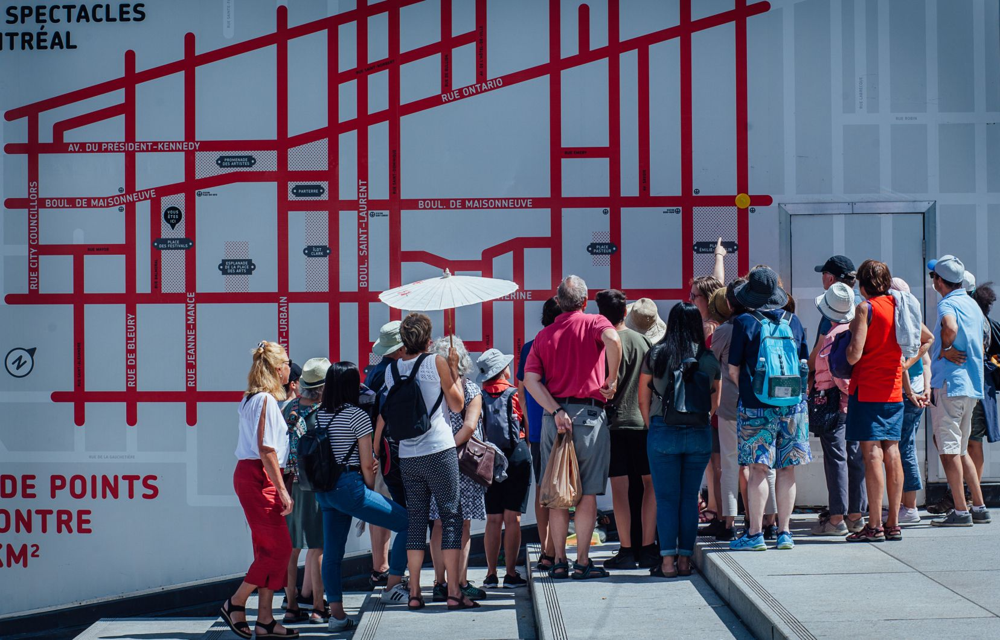

## Balades [Maths en ville](https://coeurdessciences.uqam.ca/balades-scientifiques-groupes-scolaires.html) du Coeur des sciences.

Cette balade interactive vise à vulgariser des concepts mathématiques, comme les fractales, la coloration des graphes, le ruban de Moebius, le théorème de Thalès, les paradoxes, etc. qui peuvent être observés dans la ville. Cette balade a initialement été développée par [Nadia Lafrenière](https://nadialafreniere.github.io/) et Stéphanie Schanck, sur le modèle de Maths in the City, conçu par le Mathematical Institute de l'Université d'Oxford, à Londres. Elle est toujours donnée par des étudiants aux cycles supérieurs en mathématiques fondamentales à l'UQAM.
La balade est offerte principalement aux groupes scolaires du secondaire et du collégial, mais quelques balades sont également prévues au cours de l'été pour le grand public.
J'ai personnellement animé une quinzaine de ces balades.

   

Le Devoir à publié en août 2019 un [article](https://www.ledevoir.com/vivre/560780/la-balade-maths-en-ville-devoile-montreal-sous-un-angle-mathematique) portant sur la balade. Elle a également fait l'objet d'une [entrevue](https://noovo.ca/videos/nvl/nvl-du-2-septembre-2020) sur les ondes de Noovo (voir vers la minute 10:06 du vidéo).
